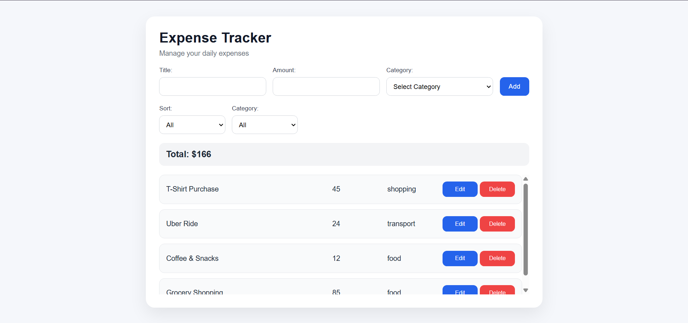

# 💰 Expense Tracker

A simple and modern expense management application built with Vanilla JavaScript.

This app allows users to manage their daily expenses by adding, editing, deleting and organizing expenses with filtering and sorting features.

---

## 🌐 Live Demo

🔗 [View Demo](https://ava-esmaeillli.github.io/javascript-mini-projects/expense-tracker/index.html)

---

## 📸 Screenshot



---

## ✨ Features

- ➕ Add new expenses
- ✏️ Edit existing expenses
- 🗑️ Delete expenses
- 💾 Save data using LocalStorage
- 🔍 Filter expenses by category
- ↕️ Sort expenses by newest and oldest
- 💰 Calculate total expenses
- 🧠 State management approach
- 📦 Modular JavaScript structure using ES Modules
- 📱 Fully responsive design

---

## 🛠️ Built With

- HTML5
- CSS3
- JavaScript (ES6+)
- LocalStorage
- ES Modules

---

## 📂 Project Structure

```
expense-tracker/
│
├── index.html
├── style.css
│
└── js/
    ├── app.js
    ├── state.js
    ├── expenses.js
    ├── filters.js
    ├── storage.js
    └── ui.js
```

---

## 🧠 What I Learned

During this project I practiced:

- Managing application state
- Separating logic into different modules
- Working with array methods
- Using LocalStorage for data persistence
- Event delegation
- Rendering dynamic UI
- Filtering and sorting data

---

## ⚙️ Installation

Clone the repository:

```bash
git clone https://github.com/ava-esmaeillli/javascript-expense-tracker.git
```

Open `index.html` in your browser.

---

## 👩‍💻 Author

**Ava**
