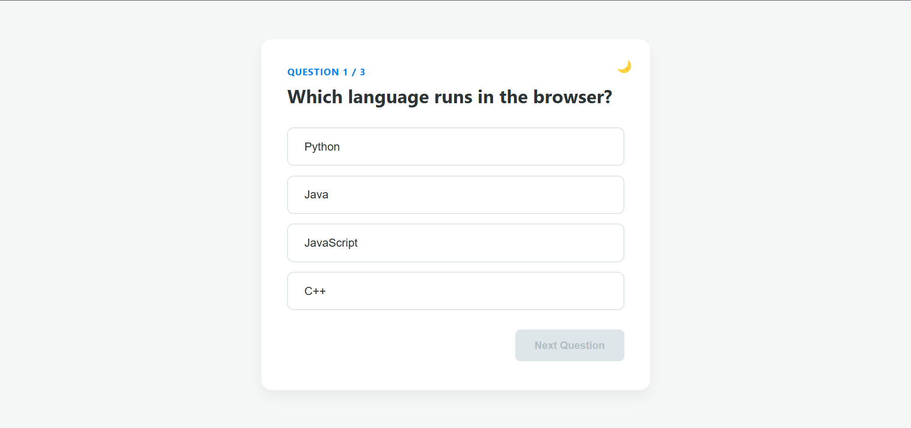
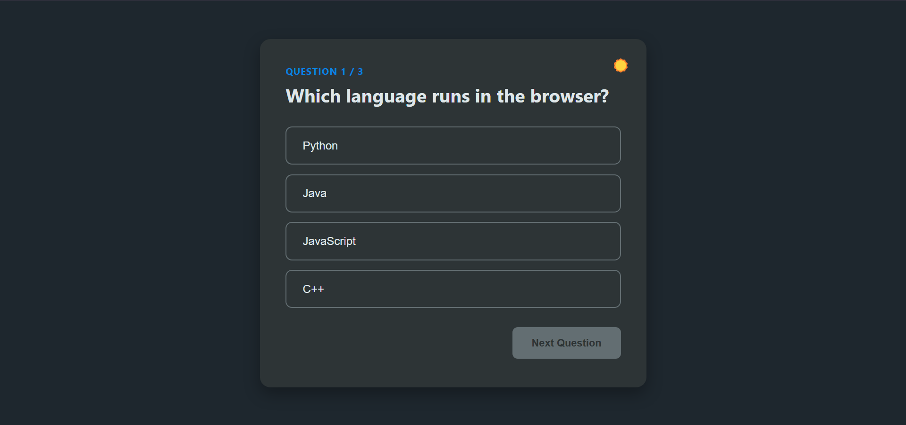

# 🎯 Quiz App
A responsive quiz application built with HTML, CSS, and JavaScript.
Users can answer multiple-choice questions, receive instant feedback, track their score, and restart the quiz. The application also includes a Dark/Light mode feature with theme persistence using LocalStorage.

---

## 🌐 Live Demo

🔗 [View Live Demo](https://ava-esmaeillli.github.io/javascript-mini-projects/quiz-app/)

---

## ✨ Features
- Multiple-choice quiz system
- Score tracking
- Correct and incorrect answer feedback
- Disable answers after selection
- Question counter
- Restart quiz functionality
- Dark / Light mode toggle
- Save selected theme using LocalStorage
- Responsive design

---

## 🛠️ Technologies
- HTML5
- CSS3
- JavaScript (ES6)
- DOM Manipulation
- LocalStorage

---

## 📂 Project Structure
```text
Quiz-App
│
├── index.html
│
├── css
│   └── style.css
│
├── js
│   └── script.js
│
├── assets
│   ├── light-mode.png
│   └── dark-mode.png
│
└── README.md
```

---

## 🚀 How to Run

Clone the repository:
```bash
git clone https://github.com/ava-esmaeillli/javascript-mini-projects.git
```
Navigate to the project folder:
```bash
cd javascript-mini-projects/quiz_app
```
Open `index.html` in your browser.

---

## 📸 Preview
### Light Mode


---

### Dark Mode


---

## 👩‍💻 Author
Created by **Ava**
