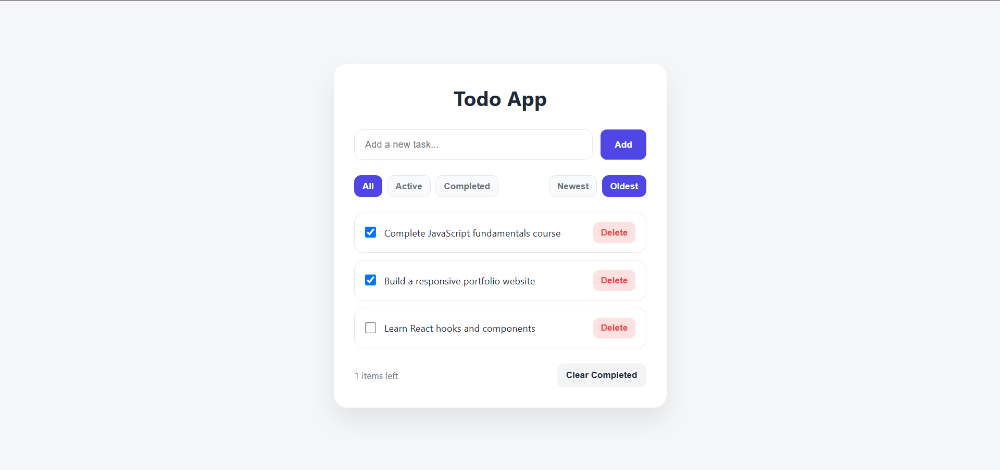

# ✅ Todo App

A modern and minimal Todo application built with **HTML, CSS, and Vanilla JavaScript**.

This project focuses on clean code structure, state management, local storage persistence, and modular JavaScript architecture.

---

## 🌐 Live Demo

🔗 [View Demo](https://ava-esmaeillli.github.io/javascript-mini-projects/todo-app/index.html)

---

## ✨ Features

- Add new todos
- Delete todos
- Mark todos as completed
- Filter tasks:
  - All
  - Active
  - Completed
- Sort tasks:
  - Newest first
  - Oldest first
- Clear completed tasks
- Data persistence using LocalStorage
- Responsive design
- Modular JavaScript structure

---

## 🛠️ Technologies

- HTML5
- CSS3
- JavaScript (ES6+)
- LocalStorage API

---

## 📂 Project Structure

```
Todo-App
│
├── index.html
├── style.css
│
└── js
    │
    ├── script.js
    ├── state.js
    ├── storage.js
    ├── todos.js
    └── ui.js
```

---

## 🧩 Architecture

The project is separated into different responsibilities:

### state.js
Stores the application's current state.

Example:
- Todos data
- Current filter
- Current sorting method


### storage.js
Handles saving and loading data from LocalStorage.


### todos.js
Contains Todo business logic:

- Add todo
- Delete todo
- Toggle completed status


### ui.js
Responsible for creating and updating UI elements.


### script.js
Acts as the main controller that connects all modules together.

---

## 💡 What I Learned

While building this project, I practiced:

- Managing application state
- Working with arrays and array methods
- Using LocalStorage
- Creating reusable functions
- Separating UI and business logic
- Using ES Modules
- Improving code organization through refactoring

---

## 🚀 How to Run

Clone the repository:
```bash
git clone https://github.com/ava-esmaeillli/javascript-mini-projects.git
```
Navigate to the project folder:
```bash
cd javascript-mini-projects/todo-app
```
Open `index.html` in your browser.

---

## 📸 Preview



---

## 👩‍💻 Author

Created by Ava
